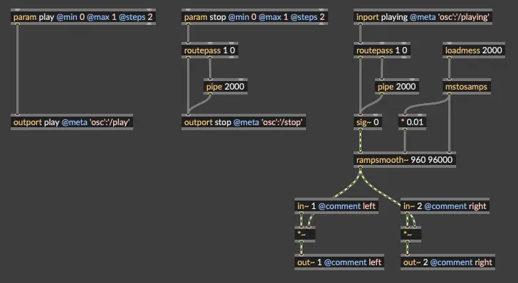

# osc-jack-play

A small C client for a Raspberry Pi (raspios trixie, e.g. the
`rnbooscquery` image) that plays WAV files through `jack-play(1)` whenever it
receives an OSC message. (Vibecoded with freebuff)

The following video is an example of osc-jack-play in use with SousaFX:
<video src="https://github.com/user-attachments/assets/79124579-5660-46a3-9e36-33541736bbdf" width="600" controls></video>

And here is a picture of a minimal rnbo patcher that can interact with osc-jack-play, included in this repo as `osc-jack-play-example.rnbopat`:



```
/play <index>   →  spawns  jack-play <wavfile[i]>   (ignored if already playing)
/stop 1         →  stops the current jack-play
<status>        →  outbound: 1 when playback starts, 0 when it stops
```

## Files

| File             | Purpose                                              |
|------------------|------------------------------------------------------|
| `osc-jack-play.c`| the OSC → jack-play client (C + liblo)               |
| `Makefile`       | builds the client against liblo                      |
| `install_jack_play.sh` | builds & installs `jack-play` from source      |
| `osc-jack-play.service` | systemd unit for running the client as a service |
| `osc-jack-play-example.rnbopat` | example patcher to export to rpi |


## Install `jack-play` (the `jack-tools` package is gone from trixie)

```bash
./install_jack_play.sh
```

This downloads the upstream source from the Debian pool, builds just
`jack-play` (needs `build-essential libjack-jackd2-dev libsndfile1-dev
libsamplerate0-dev`), and installs it to `/usr/local/bin`.

`jack-play` comes from the Debian `jack-tools` package. It is a lightweight
JACK sound file player: it creates one output port per channel in the file,
resamples to the server's sample rate (libsamplerate), and can auto-connect
via the `JACK_PLAY_CONNECT_TO` environment variable. This client does not link
against JACK itself — it just spawns `jack-play` subprocesses (one at a time).

The `jack-tools` package — which provides `jack-play` — was removed from the
Debian trixie release, so `sudo apt install jack-tools` fails on Raspberry Pi
OS trixie with *"has no installation candidate"*, which is why it must be 
built from source for use with RNBO.

## Install the rest of the dependencies (on the Pi)

```bash
sudo apt update
sudo apt install -y jackd2 liblo-dev
```

`jackd2` provides the JACK server (skip if your image already runs JACK for
RNBO); `liblo-dev` provides the OSC library. Check with `which jack-play`.

## Build

```bash
make
```

## Test via CLI

```bash
# auto-connects to main outputs
./osc-jack-play -c 'system:playback_%d' sound1.wav sound2.wav sound3.wav etc.wav

#auto-connect to patcher inputs
./osc-jack-play -c 'patchername-0:in%d' sound1.wav sound2.wav sound3.wav etc.wav
```

* Indices are **0-based** (`/play 0` .. `/play 3`); pass `-1` for 1-based.
* Listens on UDP port **7000** (change with `-p PORT`).
* `-c 'system:playback_%d'` makes `jack-play` auto-connect file channel 1 →
  `system:playback_1`, channel 2 → `system:playback_2`, etc. Works for mono and
  stereo files. If you omit `-c`, nothing is connected automatically — use
  `jack_connect` or `jack-plumbing` instead.
* While a file is playing, new `/play` messages are **ignored** (logged).
* `jack-play` can read any format libsndfile supports (wav, flac, ogg, aiff).
* Playback status is sent back over OSC to the RNBO oscquery service
  (`--rnbo-host` / `--rnbo-port`): an int `1` when a file starts and `0` when
  it stops, on the address given by `--status-address` (default `/playing`).
* Can only connect to the first two inputs of the named patcher or main output.

```bash
# RNBO runs on this Pi (defaults; usually no flags needed)
./osc-jack-play -c 'system:playback_%d' sound1.wav sound2.wav sound3.wav sound4.wav

# RNBO on another machine, our listener address advertised as this Pi's IP
./osc-jack-play --rnbo-host 192.168.1.50 --advertise-host 192.168.1.10 \
    -c 'system:playback_%d' sound1.wav sound2.wav sound3.wav sound4.wav

# plain OSC senders (no RNBO listener registration)
./osc-jack-play --no-register -c 'system:playback_%d' sound1.wav sound2.wav sound3.wav sound4.wav
```

## Run as a service (recommended)

`osc-jack-play.service` is a systemd unit following the conventions of the
`gamepad.service` example in this repo. First, edit the WorkingDirectory
and ExecStart fields to point at your
compiled binary and wav files (the `%%d` in the connect pattern is the
systemd-escaped form of `%d`), then install and start it:

```bash
sudo cp osc-jack-play.service /etc/systemd/system/
sudo systemctl daemon-reload
sudo systemctl enable --now osc-jack-play
```

Check status with `sudo systemctl status osc-jack-play` and logs with
`journalctl -u osc-jack-play -f` (you should see the RNBO listener
registration line if RNBO was already running).

Note: registration with RNBO happens once at startup, so start RNBO before
(enabling) the service, or restart the service after RNBO is up:
`sudo systemctl restart osc-jack-play`.

## Options

```
-p, --port PORT           OSC UDP port to listen on (default 7000)
-c, --connect PORTS       JACK_PLAY_CONNECT_TO pattern, e.g. 'system:playback_%d'
-n, --client-name NAME    set jack-play's JACK client name
-1, --one-based           /play indices are 1-based (default 0-based)
-r, --rnbo-port PORT      RNBO oscquery port to register with (default 1234)
    --rnbo-host HOST      RNBO oscquery host (default 127.0.0.1)
    --advertise-host HOST host advertised in the listener address
                          (default 127.0.0.1; set to this Pi's IP if RNBO
                          runs on another machine)
    --no-register         do not register as an RNBO listener
    --status-address PATH OSC path for playback status (default /playing)
-h, --help                show help
```
